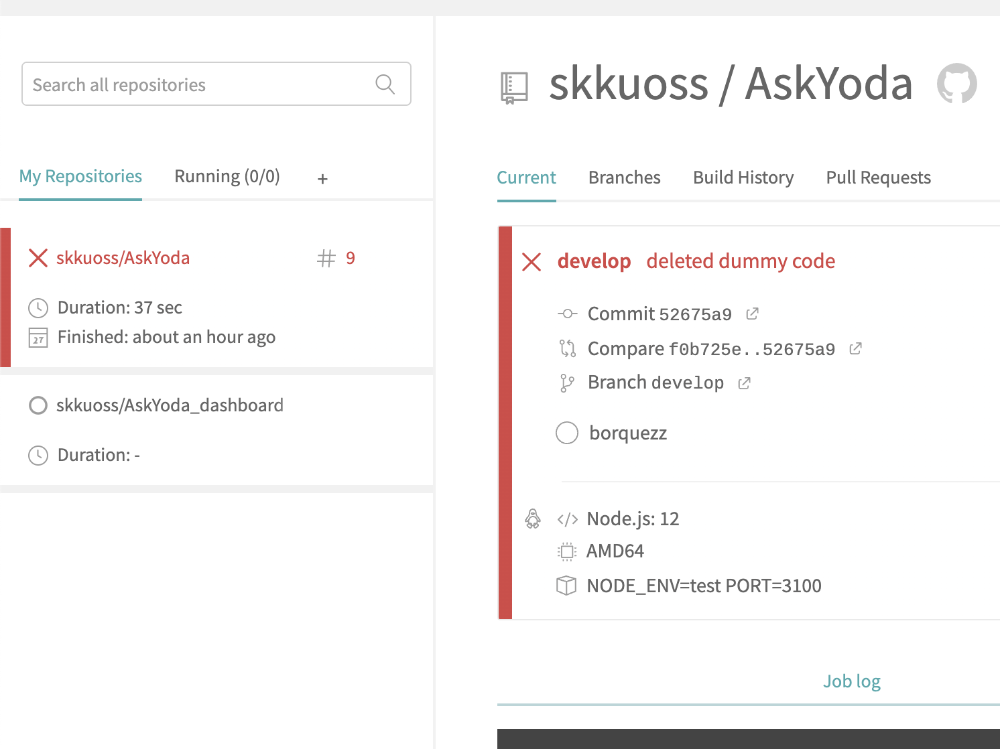
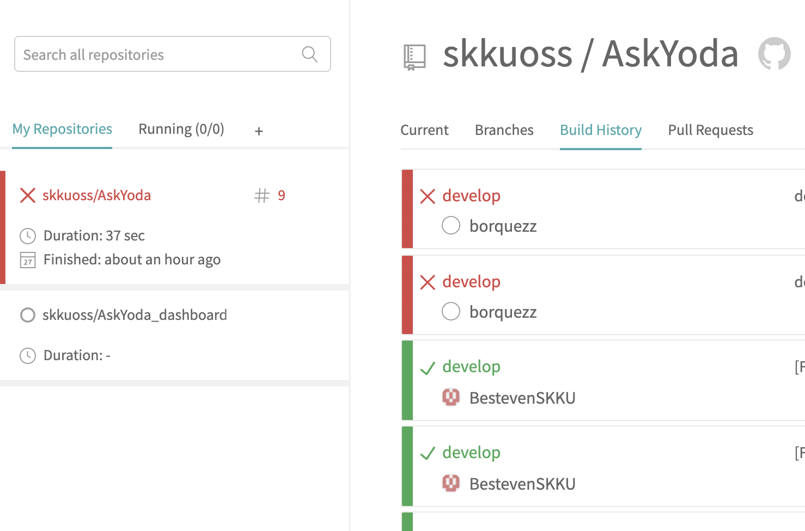

# AskYoda

**API Server of AskYoda which recommends music.**


---

## Contents

- [Installation](#installation)
- [Documentation](#documentation)
- [Continuous Integration](#continuous-integration)

---

## Installation

### 0. Prerequistes
- Node.js 12.x

### 1. Clone
```shell
$ git clone https://github.com/skkuoss/AskYoda.git
```

### 2. Install Packages
```bash
$ npm install
```
### 3-1. Create secret environment variables
```shell
$ touch .env.development
```
You have to export CLIENT_ID and CLIENT_SECRET due to Spotify.

You can certificate it from Spotify API page. Visit [`here`](https://developer.spotify.com/dashboard/applications) to get more information.
### 3-2. Start development server

```shell
$ npm start
```

After run server Access [`http://localhost:3100`](http://localhost:3100)

### 3-3. Start production server
```shell
$ export NODE_ENV=production
```
If you want to change port
```shell
$ export PORT=<PORT>
```
```shell
$ npm start
```

### 3-3. Deploy production server

If you want to use PM2
```shell
$ pm2 start npm -- start --name "AskYoda"
```

We strongly recommend setting up reverse proxy using web servers such as Nginx and Apache.

---

## Documentation

### Development Language
- Node.js

### Backend
- [`Express`](https://expressjs.com/ko/)

### API list
- Find song names by autocomplete
```shell
$ curl http://<YOUR_HOSTNAME>/v1/autocomplete?trackName=f
```
- Find recommended songs
```shell
$ http://<YOUR_HOSTNAME>/v1/recommendations?songs=<SONG_NAME_1>&songs=<SONG_NAME_2>
```

### Usage Example
1. First find the song "PSY - Gangnam Style" using autocomplete.
```shell
$ curl http://localhost:3100/v1/autocomplete?trackName=gan
{"body":{"tracks":{"href":"https://api.spotify.com/v1/search?query=gan&type=track&offset=0&limit ...
```
2. You can find it in body.tracks.items[2]
3. Next, find the song "The Beatles - Here comes the sun" same way.
```shell
$ curl http://localhost:3100/v1/autocomplete?trackName=here
{"body":{"tracks":{"href":"https://api.spotify.com/v1/search?query=gan&type=track&offset=0&limit ...
```
4. You can find it in body.tracks.items[0]
5. Now you can ask Yoda to find recommendataion songs. (You have to encode if your songs name has unicode)
```shell
$ curl http://localhost:3100/v1/recommendations?songs=Gangnam%20Style%20(%EA%B0%95%EB%82%A8%EC%8A%A4%ED%83%80%EC%9D%BC)%20-%20PSY&songs=Here%20Comes%20The%20Sun%20-%20Remastered%202009%20-%20The%20Beatles
{"tracks":[{"album":{"album_type":"ALBUM","artists":[{"external_urls":{"spotify": ...
```
6. You can find our recommendation in tracks

---

## Continuous Integration
- Our project uses Git flow to manage version of source code.
  
We proceed with all developments in the develop branch. When our incremental is ready for deployment, we merge it to the release branch and then test it. After all the tests pass, we merge to master branch to provide to other users.

- Our project uses Travis for continuous integration.

When we push to the develop branch, the Travis automatically performs the test. If all the tests pass, Travis automatically merge our commit into the release branch.



---

Copyright ⓒ 2021 SKKU OSS Team 7 All Rights Reserved